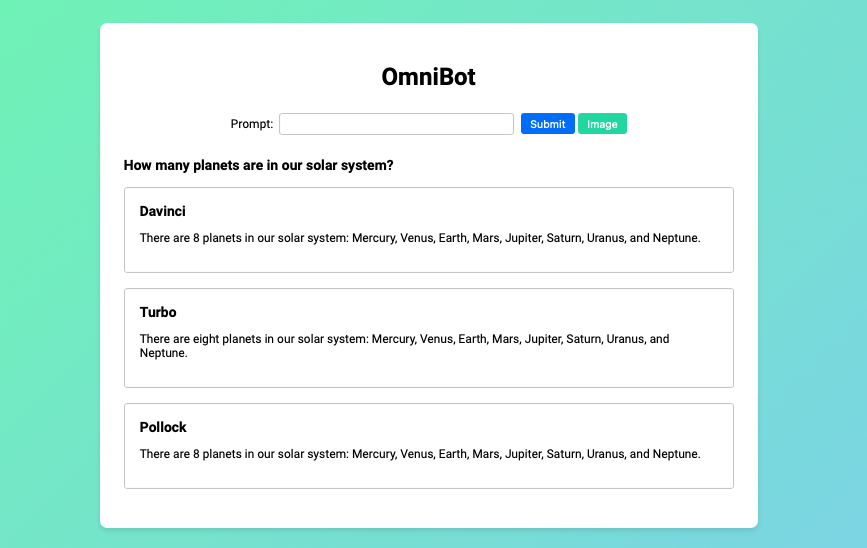
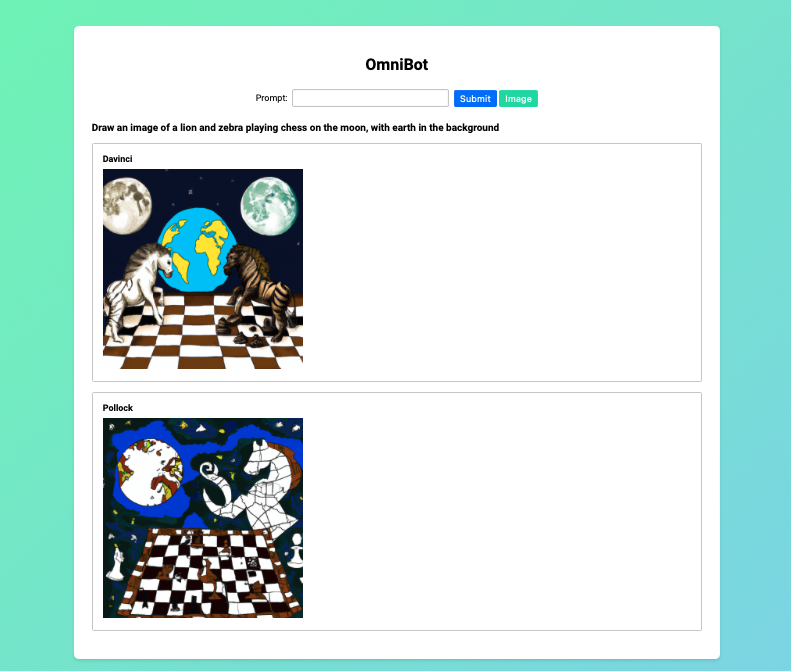

# COMP30220 Team Omni

This project is a distributed system that is designed to provide the user with response from four different models of ChatGPT when the user enters a prompt. The user can decide if they want to submit the prompt to get a text or an image response.

### link to the video showcasing the project: https://gitlab.com/ucd-cs-rem/comp30220-2023/omni/-/blob/main/Omni-Video-presentation.mp4

### link to the report: https://gitlab.com/ucd-cs-rem/comp30220-2023/omni/-/blob/main/Omni_Report.docx

*The README document should be completed and should provide:*

- *The name of the team*
- *A brief summary of what your code does*
- *Instructions on how to compile and run your code*
- *A link to the report (which should be uploaded in the root folder of your project)*
- *A link to the video showcasing your project*

## Setup
### Prerequisites
- Java 8
- Maven
- Docker
- minikube

### Starting Omni
This project run in docker and Kubernetes. If you want to run it in Kubernetes, you will need to have minikube installed and docker running in the background if you are running it locally. `run.bat` and `run.sh` will start the project in docker. `run_kube.bat` and `run_kube.sh` will start the project in Kubernetes.

**IMPORTANT**
Before running the batch/shell scripts, make sure that the `api-keys.txt` file is filled in with the correct API keys. The file should be in the root directory of the project.

#### On Linux/Mac
`bash run.sh` will start the project in docker. `bash run_kube.sh` will start the project in Kubernetes.

#### On Windows
`run.bat` will start the project in docker. `run_kube.bat` will start the project in Kubernetes.

### Opening the web client

If using `run.sh` or `run.bat`. Go to the web interface at: `http://localhost:8085/`

If `run_kube.bat` or `run_kube.sh` was used, the command-prompt/terminal will output the address of the web client and in most cases will automatically open the web-client in the browser.

## Team Members
- Ruben Ewout van Breda
- Dawid Skraba
- Oisin Mc Menamin
- Kamil Michalski